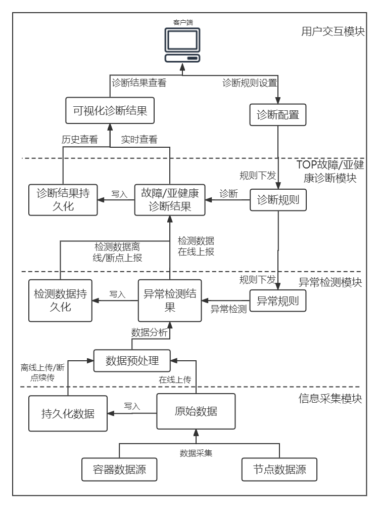

## 介绍

> 中文 | [English](README.en.md)

[CPDS](https://gitee.com/openeuler/Cpds) (Container Problem Detect System) 容器故障检测系统，是由[北京凝思软件股份有限公司](https://www.linx-info.com)设计并开发的容器集群故障检测系统，该软件系统实现了对容器TOP故障、亚健康检测的监测与识别。

## 软件功能

 **1. 采集集群信息**

在宿主机上实现节点代理，采用systemd、initv、ebpf等技术，对容器关键服务进行监控；对节点网络、内核、磁盘LVM等相关信息进行采集；对容器内的应用状态、资源消耗情况、关键系统函数执行情况、io执行状态等执行异常进行监控。

**2. 集群异常检测**

采集各节点原始数据，基于异常规则对采集的原始数据进行异常检测，提取关键信息。同时基于异常规则对采集数据进行异常检测，后将检测结果数据和原始据进行在线上传，并同步进行持久化操作。

**3. 节点、业务容器故障/亚健康诊断**

基于异常检测数据，对节点、业务容器进行故障/亚健康诊断，将分析检测结果进行持久化存储，并提供UI层进行实时、历史的诊断数据查看

## 软件架构

CPDS (Container Problem Detect System) 容器故障检测系统由4个组件组组成，整体采用微服务架构，组件之间通过API进行通信。

* [cpds-agent](https://gitee.com/openeuler/cpds-agent)：信息采集组件，负责采集集群各节点的容器和系统原始数据  

* [cpds-detector](https://gitee.com/openeuler/cpds-detector)：异常检测组件，根据配置的异常规则对各节点原始数据进行分析，检测节点是否存在异常  

* [cpds-analyzer](https://gitee.com/openeuler/cpds-analyzer)：故障/亚健康诊断组件，根据配置的诊断规则，对异常节点进行健康分析，计算出节点当前健康状态  

* [cpds-dashboard](https://gitee.com/openeuler/cpds-dashboard)：用户交互组件，提供web页面，对集群内节点健康情况进行展示，支持诊断规则配置下发  

## 安装

CPDS在linux上平台运行，安装部署方式详见各组件的README文档

## 工作计划 

1. 设计实现整体软件分层架构，从信息采集到用户交互; 2022.11.14 ~ 2022.12.5  
2. 整理、抽象容器的故障类型; 2022.12.6 ~ 2023.2.2 
3. 软件模块设计及开发; 2023.3.3 ~ 2023.8.31 
4. 运营社区，持续开发完善系统; 长期

## 项目人员

### 维护人员
<table>
    <thead>
        <tr>
            <th>组件</th>
            <th>代码评审人员</th>
            <th>代码合并人员</th>
        </tr>
    </thead>
    <tbody>
        <tr>
            <td>
                <a href="https://gitee.com/openeuler/cpds-agent">cpds-agent</a>
            </td>
            <td>
                <a href="https://gitee.com/linx-fxli">@李飞翔</a>
                <a href="https://gitee.com/zeng-junhan">@曾俊涵</a>
                <a href="https://gitee.com/weicao123">@曹伟</a>
            </td>
            <td>
                <a href="https://gitee.com/pencc">@彭驿翔</a>
            </td>
    </tr>
    <tr>
            <td>
                <a href="https://gitee.com/openeuler/cpds-detector">cpds-detector</a>
            </td>
            <td>
                <a href="https://gitee.com/linx-fxli">@李飞翔</a>
                <a href="https://gitee.com/jwzhangcn">@张经纬</a>
            </td>
            <td>
                <a href="https://gitee.com/pencc">@彭驿翔</a>
            </td>
    </tr>
    <tr>
            <td>
                <a href="https://gitee.com/openeuler/cpds-analyzer">cpds-analyzer</a>
            </td>
            <td>
                <a href="https://gitee.com/linx-fxli">@李飞翔</a>
                <a href="https://gitee.com/jwzhangcn">@张经纬</a>
            </td>
            <td>
                <a href="https://gitee.com/pencc">@彭驿翔</a>
            </td>
    </tr>
    <tr>
            <td>
                <a href="https://https://gitee.com/openeuler/cpds-dashboard">cpds-dashboard</a>
            </td>
            <td>
                <a href="https://gitee.com/linx-fxli">@李飞翔</a>
                <a href="https://gitee.com/SaarHV">@杜昊男</a>
            </td>
            <td>
                <a href="https://gitee.com/pencc">@彭驿翔</a>
            </td>
    </tr>
    </tbody>
</table>

## 指引、贡献与支持

### 贡献流程

1.  Fork 本仓库
2.  新建 Feat_xxx 分支
3.  提交代码
4.  新建 Pull Request

### 遇到问题？

请将任何 CPDS 的 Bug、问题和需求提交到 [CPDS gitee Issue](https://gitee.com/openeuler/Cpds/issues)中。

