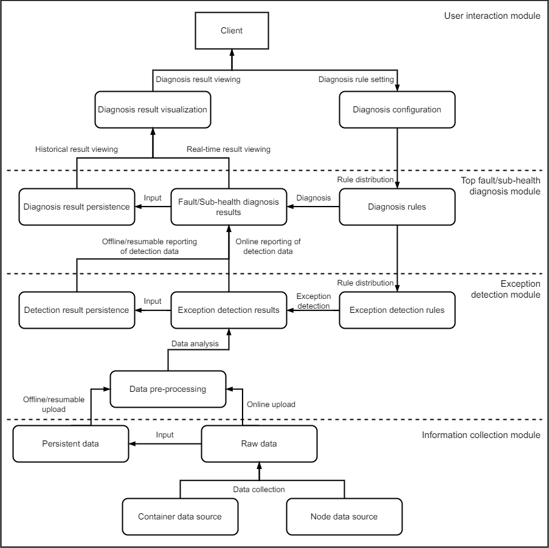

# CPDS Overview

## Introduction

CPDS (Container Problem Detect System), developed by Beijing Linx Software Corp., is a fault detection system for container clusters. It monitors and identifies container top faults and sub-health conditions.

## Key Features

**1. Cluster information collection**

The system uses node agents on host machines, leveraging systemd, initv, and eBPF technologies to monitor key container services. It collects data on node networks, kernels, drive LVM, and other critical metrics. It also tracks application status, resource usage, system function execution, and I/O operations within containers for anomalies.

**2. Cluster exception detection**

The system gathers raw data from cluster nodes and applies predefined rules to detect anomalies, extracting essential information. It uploads both detection results and raw data online while ensuring data persistence.

**3. Node and service container fault/sub-health diagnosis**

Using exception detection data, the system diagnoses faults or sub-health conditions in nodes and service containers. Analysis results are stored persistently, and a UI layer enables real-time and historical diagnosis data access.

## System Architecture

CPDS comprises four components, as illustrated below. The system follows a microservices architecture, with components interacting via APIs.

- [cpds-agent](https://gitee.com/openeuler/cpds-agent): Collects raw data about containers and systems from cluster nodes.

- [cpds-detector](https://gitee.com/openeuler/cpds-detector): Analyzes node data based on exception rules to detect abnormalities.

- [cpds-analyzer](https://gitee.com/openeuler/cpds-analyzer): Diagnoses node health using configured rules to assess current status.

- [cpds-dashboard](https://gitee.com/openeuler/cpds-dashboard): Provides a web interface for node health visualization and diagnostic rule configuration.

## Supported Fault Detection

CPDS detects the following fault conditions.

| No. | Fault Detection Item                                                 |
| --- | -------------------------------------------------------------------- |
| 1   | Container service functionality                                      |
| 2   | Container node agent functionality                                   |
| 3   | Container group functionality                                        |
| 4   | Node health detection functionality                                  |
| 5   | Log collection functionality                                         |
| 6   | Drive usage exceeding 85%                                            |
| 7   | Network issues                                                       |
| 8   | Kernel crashes                                                       |
| 9   | Residual LVM drive issues                                            |
| 10  | CPU usage exceeding 85%                                              |
| 11  | Node monitoring functionality                                        |
| 12  | Container memory allocation failures                                 |
| 13  | Container memory allocation timeouts                                 |
| 14  | Container network response timeouts                                  |
| 15  | Slow container drive read/write operations                           |
| 16  | Zombie child processes in container applications                     |
| 17  | Child process and thread creation failures in container applications |
