# 使用手册

## 介绍

CPDS(Container Problem Detect System)容器故障检测系统，是由北京凝思软件股份有限公司设计并开发的容器集群故障检测系统，该软件系统实现了对容器 TOP 故障、亚健康检测的监测与识别。

主要分为四个子模块：

1. 信息采集组件 cpds-agent：本组件根据cpds-detetor(异常检测组件)需要的数据进行相应采集。
2. 异常检测组件 cpds-detector：本组件根据cpds-analyzer(容器故障/亚健康诊断组件)下发的异常规则，对集群各节点原始数据进行分析，检测节点是否存在异常。
3. 故障/亚健康诊断组件 cpds-analyzer：本组件根据cpds-dashboard(用户交互组件)下发的诊断规则，对cpds-detector(异常检测组件)收集的异常数据进行处理，判断集群节点是否处于容器故障/亚健康状态。
4. 用户交互组件 cpds-dashboard：本组件从 cpds-analyzer(故障/亚健康诊断)组件中获取诊断结果数据，并以实时查看、离线查看的形式进行可视化诊断结果展示，便于容器集群运维人员进行分析与策略制定下发。

## 页面及功能说明

### 页面布局

CPDS页面布局分为导航栏、导航菜单、操作区。

> 页面布局如下图

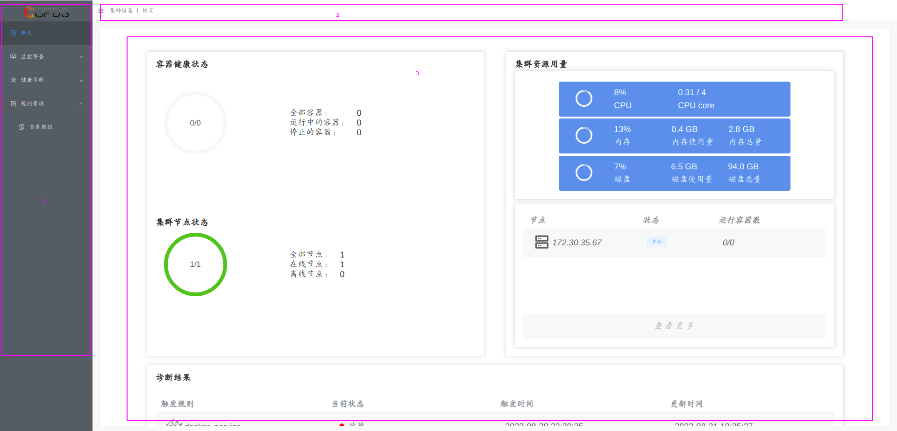

| 序号 | 名称     | 说明                                                                           |
| ---- | -------- | ------------------------------------------------------------------------------ |
| 1    | 导航菜单 | 导航菜单包含 CPDS 所有功能，选择不同菜单项后，右侧操作区将显示对应的操作页面。 |
| 2    | 导航栏   | 用于指示用户当前页面位于导航树的位置。                                         |
| 3    | 操作区   | 显示当前操作信息，提供操作功能。                                               |

### 概览

概览页面可查看整个集群的状态信息，包括集群容器健康状态、集群节点状态、集资源用量、节点监控状态、诊断结果。查看概览流程如下图所示：

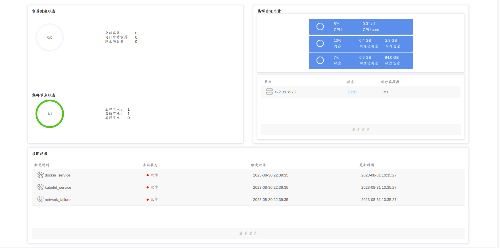

| 名称         | 说明                                                                                                                                                |
| ------------ | --------------------------------------------------------------------------------------------------------------------------------------------------- |
| 容器健康状态 | 显示集群中运行中的容器个数占全部容器个数的百分比，并显示全部容器、运行中的容器、停止的容器的个数。                                                  |
| 集群节点状态 | 显示在线节点占全部节点的百分比，并显示全部节点、在线节点、离线节点的个数。                                                                          |
| 集群资源用量 | 显示集群 CUP、内容、磁盘的使用的量、总量和使用百分比。                                                                                              |
| 节点监控状态 | 显示集群节点的 ip 地址、节点状态、节点运行容器数量占比。点击下方的查看更多，会跳转至“监控告警-节点健康”，可以查看更详细的节点信息。                 |
| 诊断结果     | 显示触发规则的名称、当前状态、规则第一次触发的时间，以及后续触发的最新时间。点击下方的查看更多，会跳转至“健康诊断-诊断结果”，查看更详细的诊断结果。 |

### 监控告警

监控告警能够对集群、节点的物理资源、容器状态进行监控。

#### 集群状态

显示集群主机在线状态，提供物理资源监控和容器健康监控。

##### 集群状态-概览

查看集群信息和节点信息，集群信息包括集群容器健康状态、集群节点状态、集资源用量。查看集群信息流程如下所示：

1. 点击左侧导航菜单“监控告警”→“集群状态”，选择“概览”标签页，进入概览页面。如下图所示：
    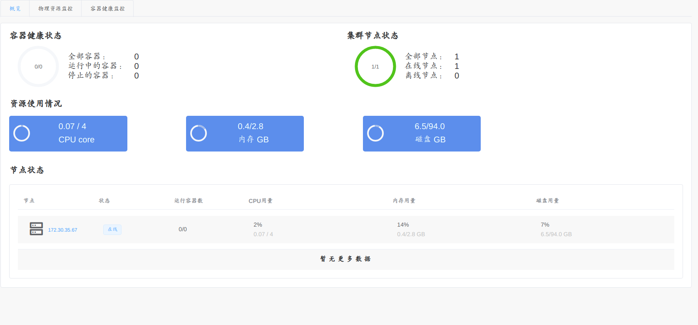

    | 名称         | 说明                                                                                               |
    | ------------ | -------------------------------------------------------------------------------------------------- |
    | 容器健康状态 | 显示集群中运行中的容器个数占全部容器个数的百分比，并显示全部容器、运行中的容器、停止的容器的个数。 |
    | 集群节点状态 | 显示在线节点占全部节点的百分比，并显示全部节点、在线节点、离线节点的个数。                         |
    | 资源使用情况 | 显示集群 CUP、内容、磁盘的使用的量和总量。                                                         |
    | 节点监控状态 | 详见 [节点健康](#节点健康)。                                                                       |

##### 集群状态-物理资源监控

点击左侧导航菜单“监控告警”→“集群状态”，选择“物理资源监控”标签页，物理资源监控页面内容如下图所示。  
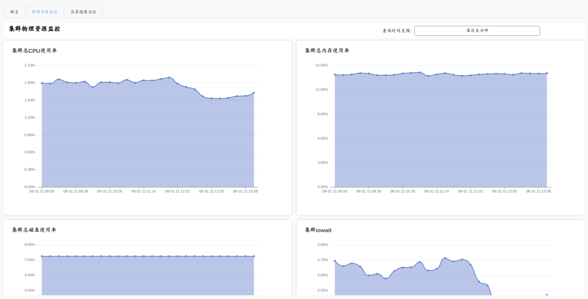

> 其中点击查询时间范围按钮可选择查询数据的时间范围，如下图所示。  
> 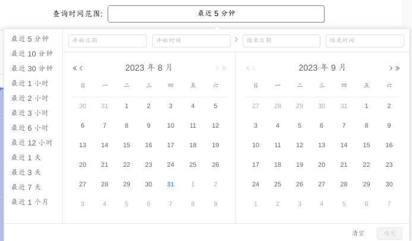

下面将对物理资源监控内容进行说明。

| 名称               | 说明                                                   |
| ------------------ | ------------------------------------------------------ |
| 集群总 CPU 使用率  | 集群 CPU 使用百分比                                    |
| 集群总内存使用率   | 集群内存使用百分比                                     |
| 集群总磁盘使用率   | 集群磁盘使用百分比                                     |
| 集群iowait         | 集群CPU等待I/O设备完成输入输出操作而处于空闲状态的时间 |
| 网络iops           | 集群网卡每秒接收和发送数据包总数                       |
| 网络网速           | 集群网卡每秒接收和发送数据大小                         |
| 网络丢包率         | 集群单位时间内网卡丢失数据包占总数据包的百分比         |
| 网络错误率         | 集群单位时间内网卡出现错误的数据包占总数据包的百分比   |
| 网络重传率         | 集群单位时间内重传数据包占总数据包的百分比             |
| 集群总磁盘吞吐速率 | 集群磁盘每秒完成读写操作的数据量                       |
| 磁盘 iops          | 集群磁盘每秒完成读写操作的次数                         |

##### 集群状态-容器健康监控

点击左侧导航菜单“监控告警”→“集群状态”，选择“容器健康监控”标签页，该页面显示集群容器健康监控信息如下图所示：  
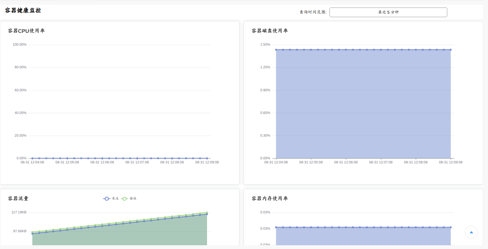

下面将对容器健康监控内容进行说明。

| 名称           | 说明                                   |
| -------------- | -------------------------------------- |
| 容器CPU使用率  | 容器 CPU 使用量占集群 CPU 总量的百分比 |
| 容器磁盘使用率 | 容器磁盘使用量占集群磁盘总量的百分比   |
| 容器流量       | 容器每秒网卡接收/发送的数据量          |
| 容器内存使用率 | 容器内存使用量占集群内存总量的百分比   |

#### 节点健康

显示各节点主机在线状态及架构信息，提供物理资源监控和容器健康监控。
> 节点健康主页面如下图所示：

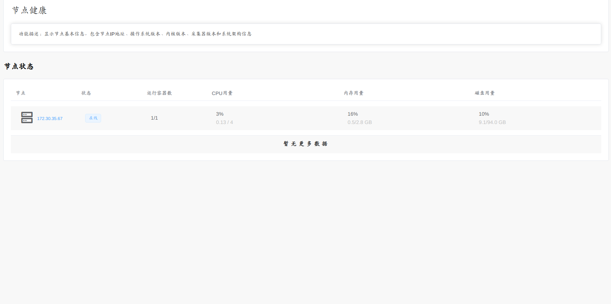

##### 节点健康-概览

点击左侧导航菜单“监控告警”→“节点健康”，点击表格中节点对应的 ip 地址进入节点概览页面。
> 节点概览页面如下图所示：

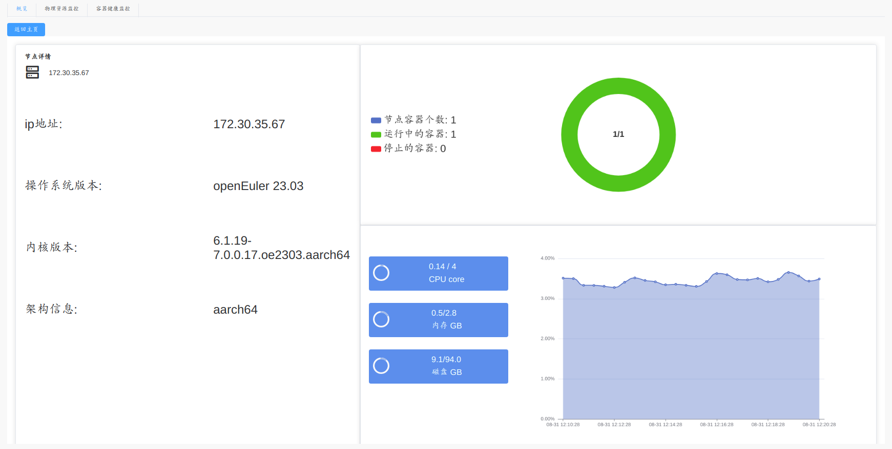

> 点击如下图三个组件，可刷新或切换曲线图展示的数据内容。

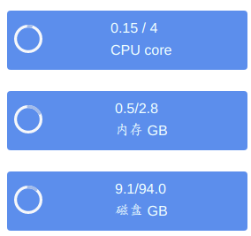

##### 节点健康-物理资源监控

点击左侧导航菜单“监控告警”→“节点健康”，点击表格中节点对应的 ip 地址进入节点概览页面，选择“物理资源监控”标签页，物理资源监控页面内容如下图所示：  
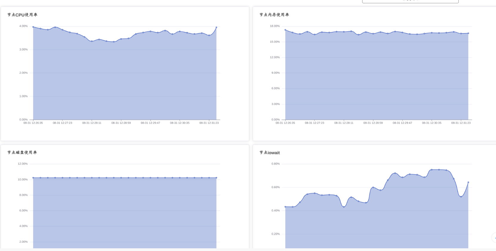

下面将对物理资源监控内容进行说明。

| 名称             | 说明                                                   |
| ---------------- | ------------------------------------------------------ |
| 节点 CPU 使用率  | 节点 CPU 使用百分比                                    |
| 节点内存使用率   | 节点内存使用百分比                                     |
| 节点磁盘使用率   | 节点磁盘使用百分比                                     |
| 节点iowait       | 节点CPU等待I/O设备完成输入输出操作而处于空闲状态的时间 |
| 节点网络iops     | 节点网卡每秒接收和发送数据包总数                       |
| 节点网络网速     | 节点网卡每秒接收和发送数据大小                         |
| 节点网络丢包率   | 节点单位时间内网卡丢失数据包占总数据包的百分比         |
| 节点网络错误率   | 节点单位时间内网卡出现错误的数据包占总数据包的百分比   |
| 节点网络重传率   | 节点单位时间内重传数据包占总数据包的百分比             |
| 节点磁盘吞吐速率 | 节点磁盘每秒完成读写操作的数据量                       |
| 节点磁盘 iops    | 节点磁盘每秒完成读写操作的次数                         |

##### 节点健康-容器健康监控

点击左侧导航菜单“监控告警”→“节点健康”，点击表格中节点对应的 ip 地址进入节点概览页面，选择“容器健康监控”标签页，容器健康监控页面如下图所示：  
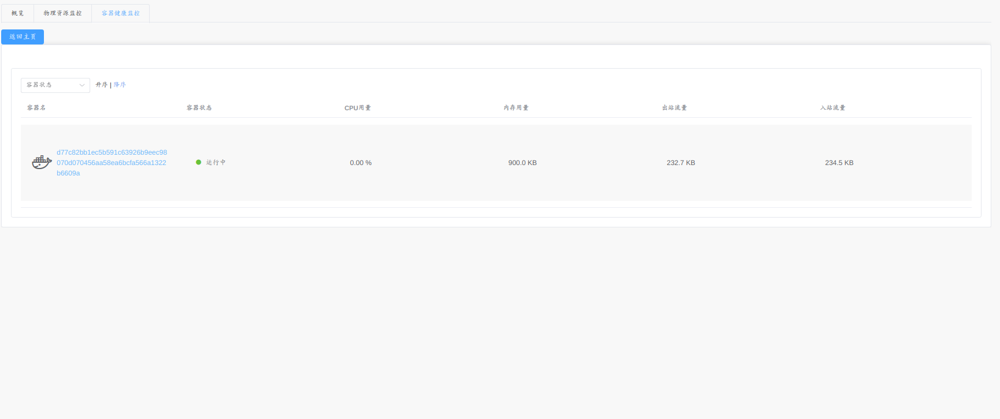

> 该页面可根据容器状态、容器名称进行排序。

节点容器健康监控数据说明如下表：

| 名称     | 说明                                                           |
| -------- | -------------------------------------------------------------- |
| 容器名称 | 容器的完整id                                                   |
| 容器状态 | 容器的运行状态，包括：运行中、已创建、停止等待、暂停共四个状态 |
| CPU用量  | 容器CPU使用率                                                  |
| 内存用量 | 容器内存用量                                                   |
| 出站流量 | 容器网卡对外发送数据大小                                       |
| 如站流量 | 容器网卡对接收数据大小                                         |

### 健康诊断

利用故障/亚健康检测规则，对各节点原始数据进行计算分析，得出诊断结果，提供诊断结果列表。支持诊断原始数据查看，显示诊断时所使用的原始数据，支持对时间进行过滤，显示不同时间段原始数据的值，并提供图表展示原始数据的变化规律。

#### 诊断结果

将规则列表中的规则拿来进行判断，满足判断条件的规则将被加入到诊断结果列表中。规则信息详见 [规则管理](#规则管理)。
查看诊断结果列表流程如下：

1. 点击左侧导航菜单“健康诊断”→“诊断结果”，进入诊断结果页面。如下图所示：  
    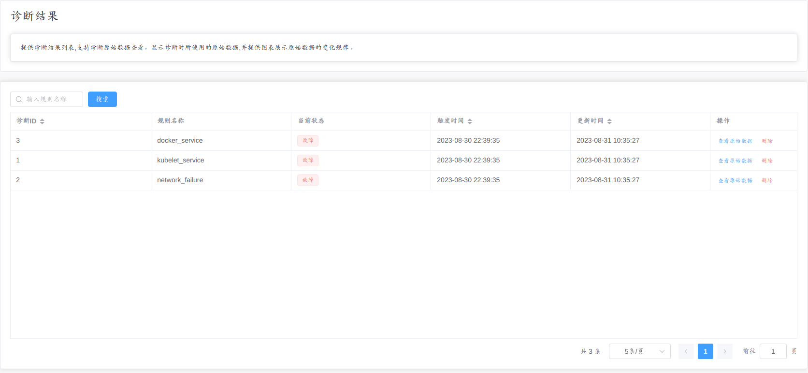

2. 可在左上角输入规则名称对诊断结果进行筛选。

3. 点击查看原始数据，可以查看最近 10 分钟内原始数据的变化规律，如下图所示：  
    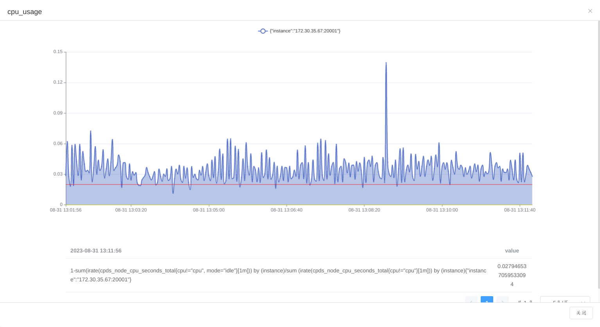

4. 点击删除可以删除对应的诊断结果。

#### 原始数据检索

支持诊断原始数据查看，显示诊断时所使用的原始数据，支持对时间进行过滤，显示不同时间段原始数据的值，并提供图表展示原始数据的变化规律。页面布局如下图所示：  
    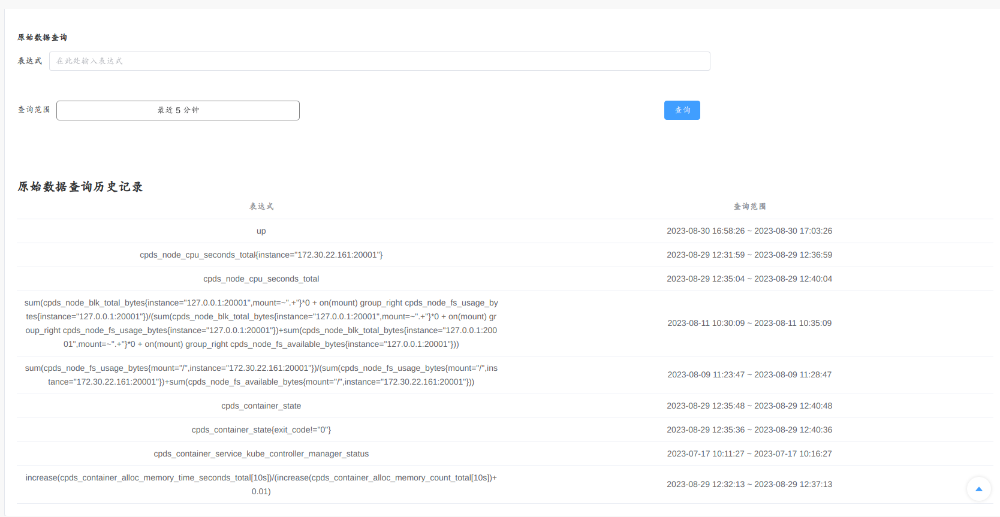

功能说明如下表所示：

| 名称         | 说明                                                                                                                                                 |
| ------------ | ---------------------------------------------------------------------------------------------------------------------------------------------------- |
| 原始数据查询 | 利用表达式对原始数据进行查询，可以设置时间选择器对时间进行过滤。可以查询到一段时间内原始数据的变化规律。                                             |
| 容器状态     | 当利用表达式成功查询原始数据后，查询记录将被记录到表格中，如果超过 10 条不同表达式记录，最先查询的记录将被删除。如果是相同表达式，那么记录会被覆盖。 |

##### 原始数据图表

原始数据图表如下图所示：  
    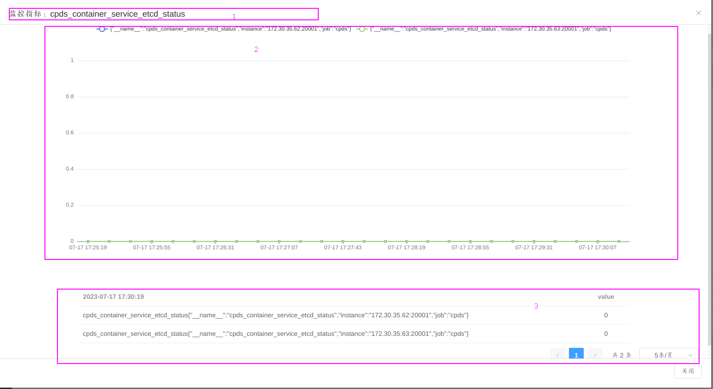

图表信息说明如下表：

| 名称           | 说明                                       |
| -------------- | ------------------------------------------ |
| 监控指标       | 显示内容为查询的表达式                     |
| 原始数据曲线图 | 显示该表达式在一段时间内查询结果的变化规律 |
| 原始数据表格   | 显示当前时间，查询结果的字段以及值         |

### 规则管理

#### 查看规则

支持故障/亚健康检测规则列表查看、创建、编辑、删除功能，列表包括规则名、表达式、告警级别和亚健康、故障比较规则值信息。查看规则流程如下：

1. 点击左侧导航菜单“规则管理”→“查看规则”，进入规则列表页面，如下图所示：  
    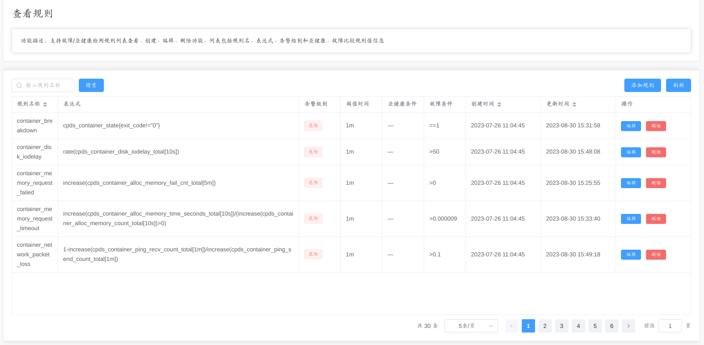

2. 通过左上角输入规则名称，点击搜索可以对规则进行过滤。
3. 点击删除可以删除对应规则。

#### 添加规则

击左侧导航菜单“规则管理”→“查看规则”，进入规则列表页面，点击添加规则或者编辑，如下图所示：  
    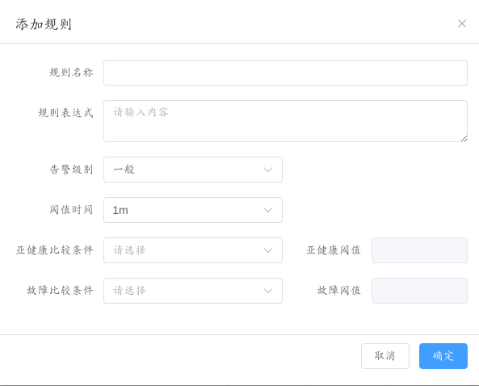

添加/编辑规则内容有如下几点限制：

1. 规则名称，只能包含数字、英文字母、下划线。
2. 表达式必须符合PromQL语法，参考[prometheus官方文档](https://prometheus.io/docs/prometheus/latest/querying/basics/)。
3. 亚健康阈值只能输入数字类型。
4. 故障康阈值只能输入数字类型。

> 阈值只能在对应的比较条件选择之后才能输入。  
> 当比较条件选择之后，对应的阈值必须填写入。  
> 亚健康比较条件、故障比较条件二者必须选择一个，或者两个都选。

## 注意事项

1. 默认规则，规则名称为node_etcd_service、node_kube_apiserver、node_kube_controller_manager、node_kube_proxynode_kube_scheduler的规则表达式中的ip需要自行更换为实际ip。
2. 当前版本CPDS只支持对docker容器运行时的故障检测。
