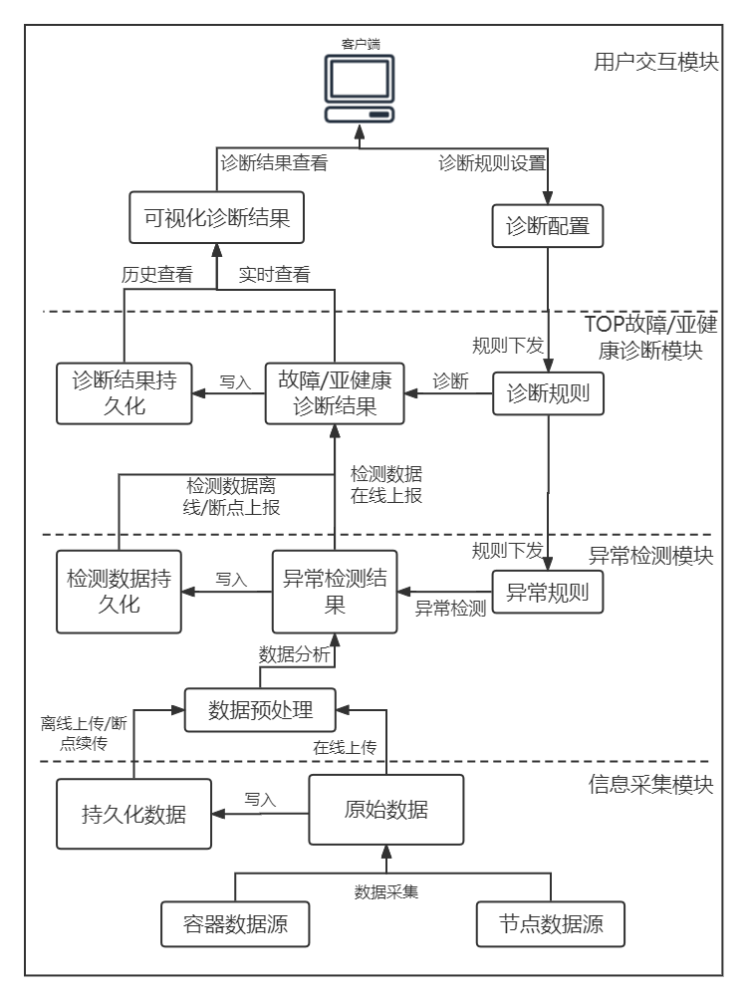

# CPDS介绍

## 概述

CPDS (Container Problem Detect System) 容器故障检测系统，是由北京凝思软件股份有限公司设计并开发的容器集群故障检测系统，该软件系统实现了对容器TOP故障、亚健康检测的监测与识别。

## 软件功能

 **1. 采集集群信息**

在宿主机上实现节点代理，采用systemd、initv、ebpf等技术，对容器关键服务进行监控；对节点网络、内核、磁盘LVM等相关信息进行采集；对容器内的应用状态、资源消耗情况、关键系统函数执行情况、io执行状态等执行异常进行监控。

**2. 集群异常检测**

采集各节点原始数据，基于异常规则对采集的原始数据进行异常检测，提取关键信息。同时基于异常规则对采集数据进行异常检测，后将检测结果数据和原始数据进行在线上传，并同步进行持久化操作。

**3. 节点、业务容器故障/亚健康诊断**

基于异常检测数据，对节点、业务容器进行故障/亚健康诊断，将分析检测结果进行持久化存储，并提供UI层进行实时、历史的诊断数据查看。

## 软件架构

CPDS (Container Problem Detect System) 容器故障检测系统由4个组件组成，如下图所示，整体采用微服务架构，组件之间通过API进行通信。

* [cpds-agent](https://gitee.com/openeuler/cpds-agent)：信息采集组件，负责采集集群各节点的容器和系统原始数据。

* [cpds-detector](https://gitee.com/openeuler/cpds-detector)：异常检测组件，根据配置的异常规则对各节点原始数据进行分析，检测节点是否存在异常。

* [cpds-analyzer](https://gitee.com/openeuler/cpds-analyzer)：故障/亚健康诊断组件，根据配置的诊断规则，对异常节点进行健康分析，计算出节点当前健康状态。

* [cpds-dashboard](https://gitee.com/openeuler/cpds-dashboard)：用户交互组件，提供web页面，对集群内节点健康情况进行展示，支持诊断规则配置下发。

## 特性

CPDS支持对以下故障项进行检测。

| 序号 | 故障检测项 |
| ---- | ---------- |
|  1   | 容器服务是否正常 |
|  2   | 容器节点代理是否正常 | 
|  3   | 容器组是否正常 | 
|  4   | 节点健康检测是否正常 | 
|  5   | 日志采集是否正常 | 
|  6   | 磁盘用量占容量85% | 
|  7   | 网络故障 | 
|  8   | 内核Crash故障 | 
|  9   | 残留LVM盘故障 | 
|  10  | CPU使用率超过85% | 
|  11  | 节点监控是否正常 | 
|  12  | 容器内存申请失败 | 
|  13  | 容器内存申请超时 | 
|  14  | 容器网络响应超时 | 
|  15  | 容器磁盘读写缓慢 | 
|  16  | 容器应用僵尸子进程监测 | 
|  17  | 容器应用占用子进程、线程创建失败监测 |
